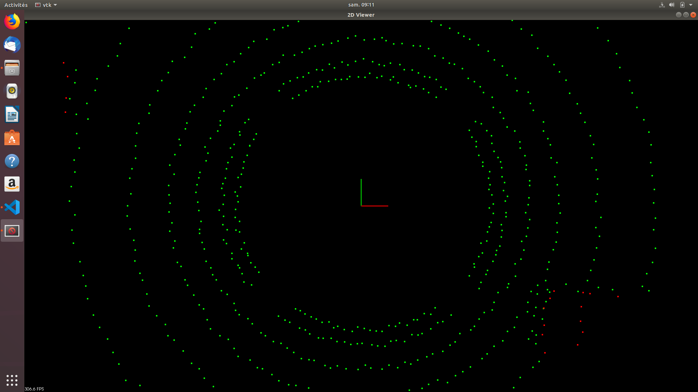
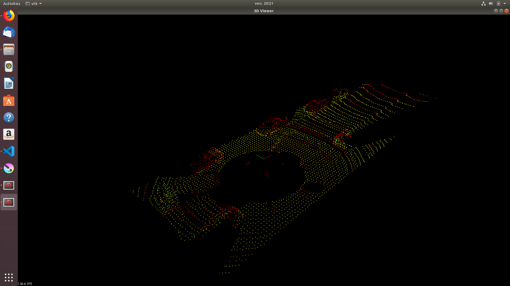

## SW-Pipeline (filtering-segmentation-clustering) to detect obstacle from the raw data Lidar Point Clouds.  

### Use of the RANSAC method (for the segmentation step) 
### Use of the Euclidean Clustering method (for the clustering step)
---------------------------------------------------------------

The target of this project is to implement a SW pipeline to detect the obstacles with a lidar solution (type velodyne). 

The input data are the raw data from the lidar named "original point cloud" (PCD File).

The output data are the box around the obstacles in the "regional point cloud" (PCD File).

The SW pipeline is comoposed of 3 importants stages : 

  - the point cloud filtering (voxel cubic cell configuration and the crop box definition), 
  
  - the point cloud segmentation (Road/Obstacle segmentation with the RANSAC -RANdom SAmple Consensus methods to separate the inliers and the ouliers),
  
  - the point cloud clustering (Euclidean clustering to find the cluster). 

Final results (with multiple PCD files in streaming) :
<p align="center">

</p>

-------------------------------------------------------------

### Lidar Technology (3D Solution)
The Lidar sensing gives us high resolution data by sending out thousands of laser signals. 

These lasers bounce off objects, returning to the sensor where we can then determine how far away objects are by timing how long it takes for the signal to return. 

Also we can tell a little bit about the object that was hit by measuring the intensity of the returned signal. 

Each laser ray is in the infrared spectrum, and is sent out at many different angles, usually in a 360 degree range. 

The lidar sensors gives us very high accurate models for the world around us in 3D.


### Point Cloud Library (PCL)
This open source library PCL is the library used for the PCD files treatment.

The Point Cloud Library (PCL) is a standalone, large scale, open project for 2D/3D image and point cloud processing.

An additional Wiki resource is available at https://github.com/PointCloudLibrary/pcl/wiki.

The filtering, segmentation and clustering functionalities of this library has been used. 

In parallel, the RANSAC (RANdom SAmple Consensus) and the KD-Tree (with K=3) will be however developed from scratch in the folder "Quiz" during the previous lesson.

It's possible to find the entire RANSAC code in the function RANSACPlane in the file ProcessPointClouds.cpp and the entire KD-Tree (K=3) code in ProcessPointClouds.h.

-----------------------------------------------------------------

### Functions definition

#### ProcessPointClouds.h
The ProcessPointCLouds.h (header file) includes the  structure KD-Tree  (K=3) functionnalities (insert point and search point) useful for the euclidean clustering calculation.

This structure is composed of the basic functions for a KD Tree : insert node and search node in a KD Tree (K=3). 

#### ProcessPointClouds.cpp
The ProcessPointClouds.cpp is the file with all the important functions :

- Filtering stage :  FilterCloud function

- Segmentation Stage : SeparateClouds or RansacPlane functions 

(SeparateClouds is only a parameters configuration from the PCL (SeparateClouds) and the RansacPlane implemented from scratch (RansacPlane))

- Clustering Stage  : EuclideanCluster and ClusterHelper functions with the use of a KD-Tree (K=3).

The others standard functions are :loadPCD, savePCD, streamPCD and Box construction around the detected obstacle cluster.

#### Environment.cpp
Environment.cpp calls the functions (defined in ProcessPointClouds) one by one, as defined in the SW Pipeline (Filtering/Segmentation/Clustering).

It's only able to process obstacle detection on a single pcd file.

#### Environment_Videos.cpp
Environment_Videos.cpp is only an adaption of a Environment.cpp. 

In comparaison with environment.cpp, it's only the integration of additional arguments in the function "CityBlock" (we don' t have to recreate the object at every frame)and a 

modification in the main() program. 

-----------------------------------------------------------------

### Preliminary

#### RANSAC (RANdom SAmple Consensus) implementation
The RANSAC method will be used for the segmentation step. The target of this method is to separate the inliers (road) and the outliers (obstacle).

The segmentation step has for target to make a segmentation between the obstacle point cloud (named SegmentCloud.first) and the road point cloud (names SegmentCloud.second). 

The RANSAC method is an iterative method : each iteration picks randomly subset of 3 points (for a plane) and we fit a model (line fitting) to the points. 

The points that are within a certain distance to the model are counted as inliers. And we make iteration, the target is to find the most inliers for a model.

The iteration that has the highest number of inliers is then the best model. 

The RANSAC implementation is in the function RansacPlane in ProcessPointClouds.cpp.

You can find th results below :

in red : the obstacle point are colored in red and the road point are colored in green.
<p align="center">

</p>

#### KD Tree (with K=2 in the previous lesson/Quiz, and K=3 for a plane in the project/ProcessPointClouds.h) implementation
The KD Tree will be used for the clustering step. The target is to build a KD Tree with the basic functionnalities (insert point + search point) implemented in

ProcessPointClouds.h.

You can find the results below (for K=2) :

you can see 11 points partitioned in 3 clusters with a KD Tree (K=2).
<p align="center">

</p>

-----------------------------------------------------------------

### SW Pipeline

#### 0- Input Point Cloud
The first step is to load a real single PCD with the target to create a "Input Point cloud".

The result of this pipeline stage is :
<p align="center">

</p>


#### 1- Filtering

    - Input = Original Point Cloud with the raw data
    - Activities = Filtering with the voxel cubic cell + Regional point cloud definition (Crop Box)
    - Output = Regional Point Cloud (Crop Box)

The filtering step is composed of 2 steps :
- the filtering of the lidar raw data with a voxel grid filter (the target is to have 1 point in one cubic cell). 

The resolution of the point cloud depends of the cube size. In others words, more the size of the cubic cell is small, better is the resolution. 

The definition of the cubic cell (length, width, depth) is very important to increase the resolution.

    - Code Implementation :
    - VoxelGridCell = 0.3 * 0.3 * 0.3 applied for the Input Filter Cloud
    - pcl::PointCloud<pcl::PointXYZI>::Ptr regionCloud = pointProcessorI ->FilterCloud(inputCloud,0.3, Eigen::Vector4f (-15,-6,-3,1), Eigen::Vector4f (35,7,2,1));


- the definition of the regional cloud (named Crop Box).  
In this step we must visualize only the region of interests, because we must sample a massive point cloud with 120.000 points.

That why we must define the most important road location in the raw point cloud to reduce the treatment of number of points.

The definition of the regional cloud (crop box) is very important to avoid a collision.


    - Code Implementation :
    - Area of interests definition (Crop Box) behind : -15 meters behind [-6,-3,1] are the [X,Y,Z] minimum points
    - Area of interests definition (Crop Box) ahead : +35 meters ahead [7,2,1] are the [X,Y,Z] maximum points
    - pcl::PointCloud<pcl::PointXYZI>::Ptr regionCloud = pointProcessorI ->FilterCloud(inputCloud,0.3, Eigen::Vector4f (-15,-6,-3,1), Eigen::Vector4f (35,7,2,1));


The result of this stage is the regional Point Cloud (Crop Box) :
<p align="center">

</p>

-------------------------------------------------------------------------------------

#### 2- Segmentation (Separating Point Cloud (Obstacle Point Cloud and Road Point Cloud)) with RANSAC (Random Sample Consensus)

    - Input = Regional Point Cloud
    - Activities = RANSAC Algorithm
    - Output = Obstacle Point Cloud named SegmentCloud.first, Road Point Cloud named SegmentCloud.second

The segmentation step has for target to make a segmentation between the obstacle point cloud (named SegmentCloud.first) and the road point cloud (names SegmentCloud.second).

The RANSAC method is an iterative method : each iteration picks randomly subset of 3 points (for a plane) and we fit a model (line fitting) to the points. 

The points that are within a certain distance to the model are counted as inliers. And we make iteration, th target is to find the most inliers for a model. 

The iteration that has the highest number of inliers is then the best model. 


    - Code Implementation :
    - 110 iterations to find the best model, and a distance tolerance of 0.2 meters
    - std::pair <pcl::PointCloud<pcl::PointXYZI>::Ptr, pcl::PointCloud<pcl::PointXYZI>::Ptr> segmentCloud = pointProcessorI->RansacPlane(regionCloud,110,0.2);


The result of this stage is the "Road Point Cloud" :                                                                 
<p align="center">

</p>

The result of this stage is the "Obstacle Point Cloud" : 
<p align="center">

</p>

----------------------------------------------------------------------------------------------------------------

#### 3- Clustering Obstacles with the Euclidean Clustering

    - Input = Obstacle Point Cloud
    - Activities = EuclideanClustering (with the call of the KD-Tree (K=3) structur)
    - Output = Obstacle Cluster with different colors + Box around the cluster in the Regional Point Cloud


Once the KD-Tree method for searching for nearby points is implemented,its not difficult to implement a euclidean clustering method that groups individual cluster indices based 

on their proximity. 

EuclideanCluster which return a vector of vector ints, this is the list of cluster indices.

To perform the clustering, we must iterate through each point in the cloud and keep track of which points have been processed already. 

For each point add it to a list of points defined as a cluster, then get a list of all the points in close proximity to that point by using the search function from the 

previous exercise. 

For each point in close proximity that hasn't already been processed, add it to the cluster and repeat the process of calling proximity points. 

Once the recursion stops for the first cluster, create a new cluster and move through the point list, repeating the above process for the new cluster. 

Once all the points have been processed, there will be a certain number of clusters found, return as a list of clusters.

    - Code Implementation :
    - In the Obstacle Point Cloud (segmentCloud.first), 0.3 is the distance tolerance, 20 points is the minimum sizecluster and 500 points is the maximum sizecluster
    - std::vector<pcl::PointCloud<pcl::PointXYZI>::Ptr> cloudClusters = pointProcessorI->euclideanCluster(segmentCloud.first, tree, 0.3, 20, 500);


You can find here the pseudocode of the Euclidean Clustering agorithm (implemented in ProcessPointClouds.cpp):
<p align="center">

</p>
                                                                                   
                                                                                   
The results of this pipeline step is the "obstacle point cloud" with differents colors for every cluster (obstacle): 
<p align="center">

</p>


The result of this pipeline stepe is  the "obstacle point cloud" with box around the obstacle :                                                                        
<p align="center">

</p>
---------------------------------------------------------------------------------------------


#### Installation

##### Ubuntu 

```bash
$> sudo apt install libpcl-dev
$> cd ~
$> git clone https://github.com/udacity/SFND_Lidar_Obstacle_Detection.git
$> cd SFND_Lidar_Obstacle_Detection
$> mkdir build && cd build
$> cmake ..
$> make
$> ./environment
```

##### Windows 

http://www.pointclouds.org/downloads/windows.html

#### Build from Source

[PCL Source Github](https://github.com/PointCloudLibrary/pcl)


